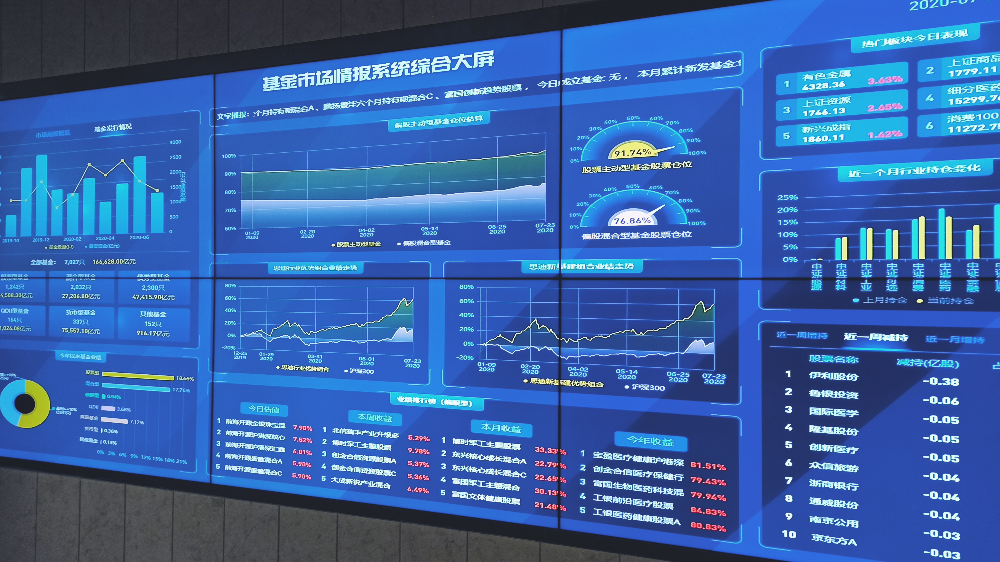
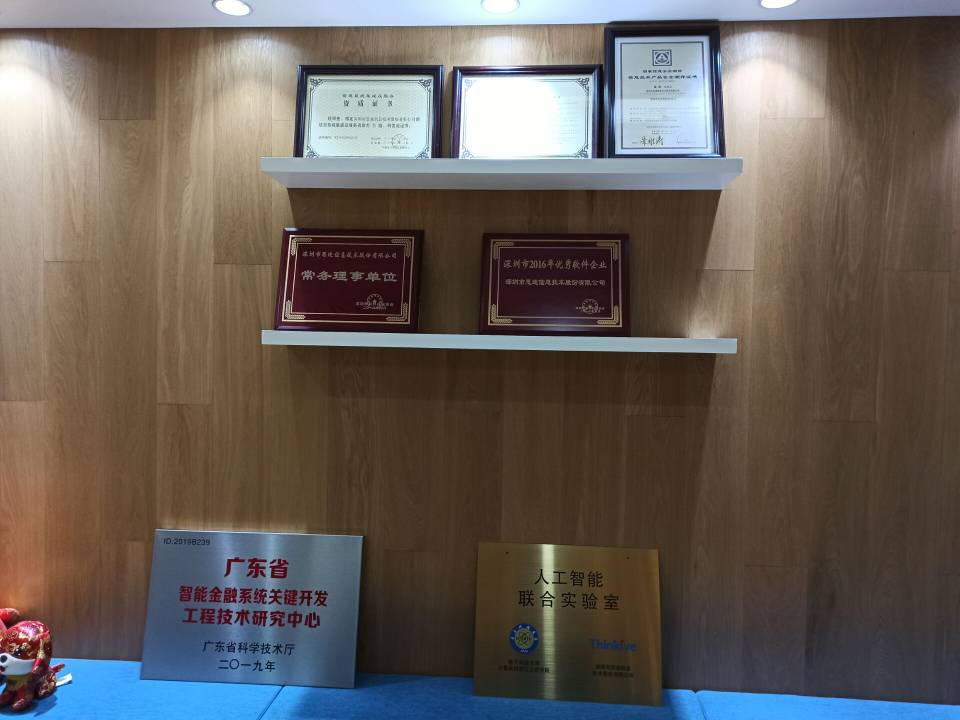
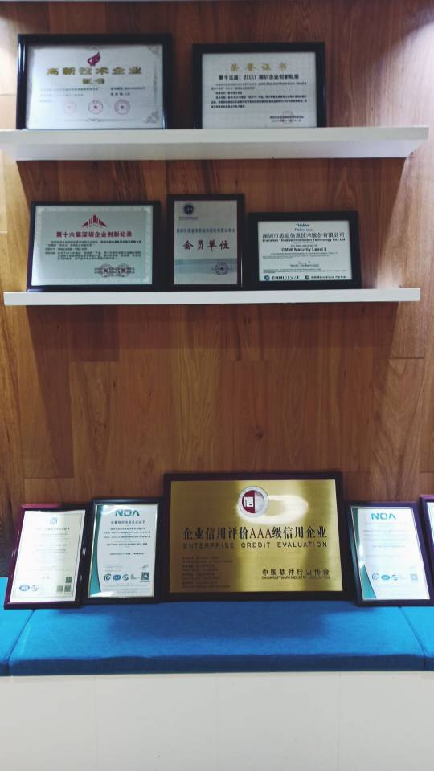

## thinkive
thinkive (深圳市思迪信息技术股份有限公司) 于 2006年8月8日 在深圳成立，是中国领先的金融科技软件解决方案提供商。

累计为200多家金融机构提供网络化和智能化解决方案，覆盖了80%以上的券商以及20多家银行。

[企业简介](http://www.thinkive.com/main/we/company_intro/index.html) &bull;  [企业主页](http://www.thinkive.com/main/index/index.html) &bull;  [合作客户-金融机构list](http://www.thinkive.com/main/we/joint_customer/index.html)

## 企业环境（base深圳总部）

>缺少科学上网环境可能会图片显示失败，可以点击查看该目录下.jpg文件

